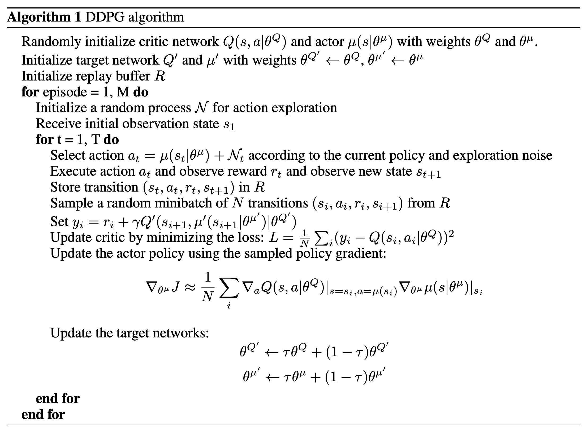
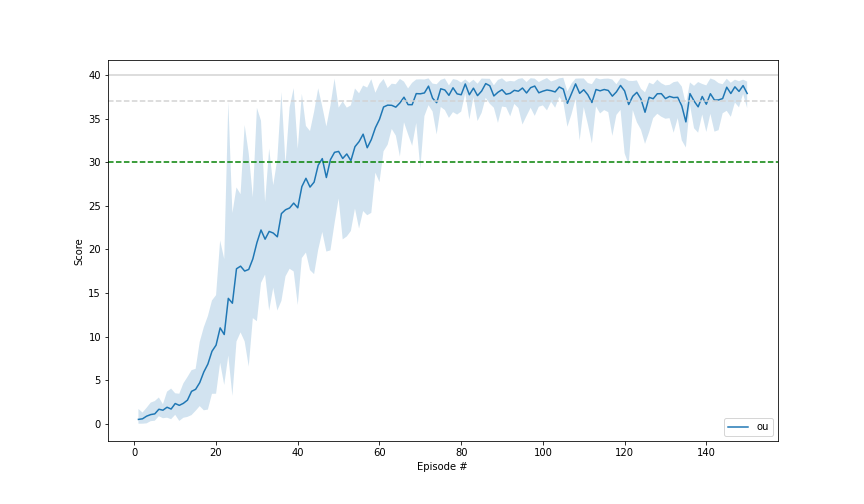
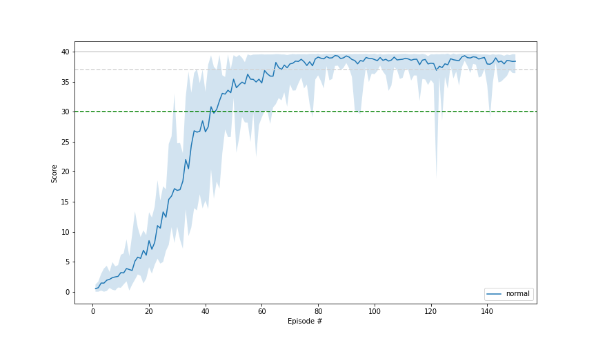
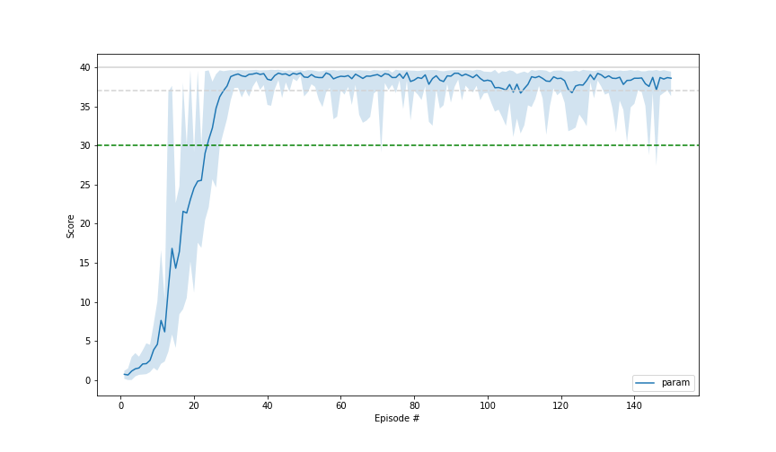
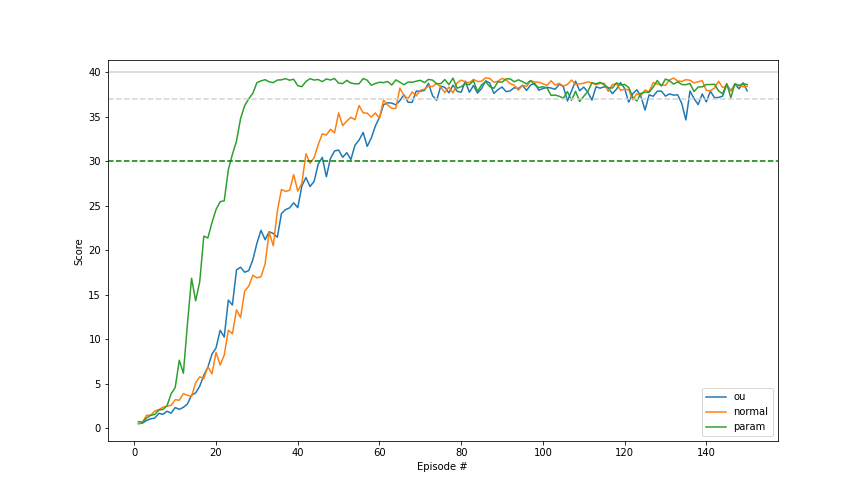

# Learning Algorithm

I implemented a Deep Deterministic Policy Gradient (DDPG) algorithm, introduced by Google researchers in this [paper](https://arxiv.org/abs/1509.02971) for the 20 agents version of the Unity "Reacher" environment. The implementation uses a replay buffer, soft update for the Actor and Critic target networks. 

## DDPG 

The Deep Deterministic Policy Gradient (DDPG) algorithm is similar to Deep-Q-Networks. While DQNs are only for descrete action spaces, DDPG is designed to work for continues action spaces. (Therefore considered for the Reacher Environment). 
DDGP counts among the Actor-Critic methods. The algotithm uses two neural networks. An Actor and a Critic. The Actor approximates the best action for a given state determinitically. The Critic is used as Q-function approximator and maps the given state and the action from the Actor to the Q value. 


*original DDPG algorithm from the [original paper](https://arxiv.org/abs/1509.02971)*

This implementation does not update the Actor and the Critic on every timestep. 

### Experience Replay
DDPG utilizes a replay buffer. On every timestep, the experiences (states, actions, rewards, next_states) of the agents will be stored in a replay buffer for later learning. After a defined amount of those timesteps a minibatch of random samples of defined size is taken from the replaybuffer and used to train the networks. This gives the opportunity to learn from past as well. This helps to stabilize the learning.

### Target Networks
DDPG uses target networks. The target network used for the taget values are time delayed copys of the regular networks. They do not change on the learning step. 
After the learning step they get a soft-update. The soft-update blends a given amount, donated by the parameter tau, of the regular network into the target network. 
The usage of target network stabilizes the learning.

### Exploration Noise
For exploration noise is added to action values. Besides the commonly used Ornstein-Uhlenbeck process noise, I tried normal noise and [adaptive parameter noise](https://arxiv.org/abs/1706.01905) as well. OU-Noise (Ornstein-Uhlenbeck process noise) is sampled from the Ornstein-Uhlenbeck process. The process needs to be initialized first. The second method, Normal Action Noise simply adds normal noise to the action values.  
The third method is a little different.

### Adaptive Parameter Noise
It adds noise to the weights of the Actor, forward pass the state values and get noised action values this way instead of adding the noise to the action values.
If noise is put directly to the weights of the network, we can not say how much it will affect the action values. And even worse, the impact will change over time. 
We make a copy of the current Actor and put a little amount of noise to its weights. Then we forward pass the state thru both networks and calculate the distance between the results.
If the distance is greater than the desired value, we decrease the amount of noise we put to the weights next time, and if the distance is lower than the desired value, we increase the amount of noise. The desired value is a new hyperparameter we chose similar to selecting the standard deviation on normal noise.

### The architecture of the networks

```
Actor(
  (seq): Sequential(
    (0): Linear(in_features=33, out_features=300, bias=True)
    (1): BatchNorm1d(300, eps=1e-05, momentum=0.1, affine=True, track_running_stats=True)
    (2): ReLU()
    (3): Linear(in_features=300, out_features=400, bias=True)
    (4): ReLU()
    (5): Linear(in_features=400, out_features=4, bias=True)
    (6): Tanh()
  )
)

Critic(
  (seq1): Sequential(
    (0): Linear(in_features=33, out_features=300, bias=True)
    (1): BatchNorm1d(300, eps=1e-05, momentum=0.1, affine=True, track_running_stats=True)
    (2): ReLU()
  )
  (seq2): Sequential(
    (0): Linear(in_features=304, out_features=400, bias=True)
    (1): ReLU()
    (2): Linear(in_features=400, out_features=1, bias=True)
  )
)
```
The results of the Actor and the first sequence of the Critic are passed together to the second sequence of the Critic.

## Hyperparameters
For all three kinds of adding noise, I used the same architecture and hyperparameters, except for the method-specific ones.

```
       state_size: 33
      action_size: 4
      random_seed: 0
       noise_type: normal
      learn_every: 16
          n_learn: 16
      alpha_actor: 0.001
     alpha_critic: 0.001
       batch_size: 256
      buffer_size: 1000000
            gamma: 0.99
              tau: 0.001
 desired_distance: 0.7
           scalar: 0.05
     scalar_decay: 0.99
    normal_scalar: 0.25
```

# Results
All three methods solved the environment.

## Ornstein-Uhlenbeck Process Noise
reaches a score of score mean of 30 after 46 episodes and stayed after 48 episodes above this value. I think it is a good result.


## Normal Noise
reaches a score of score mean of 30 after 43 episodes and stayed after 45 episodes above this value. I think it is a good result too and very similar to the first one.


## Adaptive Parameter Noise
reaches a score of score mean of 30 after 24 episodes and stayed above this value. For me, it is an impressive result. The learning curve shows how quickly the agent learns with this method. 


## Comparison
The direct comparison shows, that ou-noise (blue) and normal noise (orange) get good and very similar results. The adaptive parameter noise (green) gets a better - not to say impressive - result. 


# More Details
I wrote an [article](https://medium.com/@soeren-kirchner/deep-deterministic-policy-gradient-ddpg-with-and-without-ornstein-uhlenbeck-process-e6d272adfc3) on this subject on medium.com

# Future Enhancements
One could try other algorithms like A3C. And one could try to optimize the hyperparameters further. In addition a prioritized experience replay could be used for the replay buffer and would eventually improve the performance.